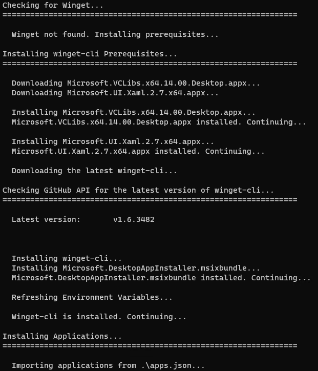

# Windows Initialization and Software Installation Script

This PowerShell script initializes a Windows 10/11 x64 machine and installs initial software needed by employees at a company or for individual use. It uses the winget package manager to install applications listed in the `apps.json` file.

## Requirements

-   Windows 10/11 x64 machine
-   PowerShell 5.1 or later
-   Internet connectivity

## Usage

1. Clone this repository to your local machine.
2. Open PowerShell as Administrator and navigate to the directory where the script is located.
3. Set Execution Policy to Bypass: `Set-ExecutionPolicy Bypass` **#Remember to never run scripts blindly.**
4. Run the script by entering the following command: `.\initialize.ps1`.

## Functionality

The script consists of the following functions:

- `AAP`: installs AppxPackage. 
- `InstallPrereqs`: installs winget prerequisites from the `.\prereqs` directory. 
- `WingetCheck`: checks for winget; if it doesn't exist, installs prerequisites and winget. 
- `InstallApps`: installs apps from JSON list. **#You may comment out InstallApps in the "Call Functions" section if you would only like the script to install Winget.**

The script checks whether the winget package manager is installed on the machine. If it is not installed, the script installs the prerequisites for winget and then downloads and installs winget. After installing W=winget, the script installs the applications listed in the `.\apps.json` file using winget import.

## Notes

- This script has been tested on Windows 10/11 x64.
- The `apps.json` file contains a list of apps to be installed using winget.

## Credits

This script was created by RuxUnderscore, aka. Rux, and is licensed under the MIT License. If you have any questions or issues with the script, please open an Issue.

## License

This project is licensed under the MIT License - see the LICENSE file for details.
